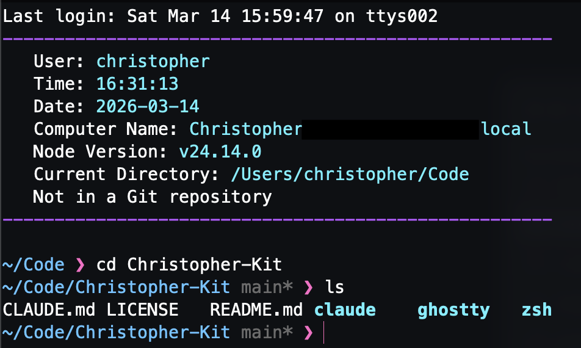
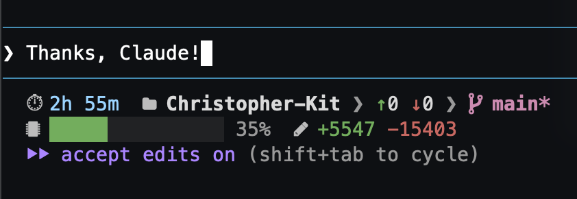

# Christopher-Kit

A portable dev toolkit for setting up a familiar development environment on any machine. Clone the repo, copy or symlink the configs you need, and get to work.


*Shell startup with myinfo() and Powerlevel10k Pure prompt*


*Claude Code status line showing session time, git status, context usage, and lines changed*

## What's Included

- **Zsh** - Custom `.zshrc` with Powerlevel10k, utility functions, and shell helpers
- **Ghostty** - Terminal config with Cyberdream color palette and semi-transparent background
- **Claude Code**
  - **Status Line** - Two-line status bar showing session time, git status, context usage, and rate limits
  - **Skills** - Custom slash commands (`/msg`, `/review-me`, `/grind`, `/audit`, `/scaffold`, `/deps`)
  - **Agents** - Specialized AI agents (orchestrators, framework experts, and more)
  - **Settings** - Example settings.json with MCP server configs (Context7, MUI, Tailwind, GitHub, AWS)

## Getting Started

```bash
git clone https://github.com/christopherrobin/Christopher-Kit.git
cd Christopher-Kit
```

Copy or symlink the configs you need to their expected locations. Setup instructions for each config are documented in their respective directories.

## Directory Structure

```
Christopher-Kit/
├── zsh/                  # Zsh shell config
│   ├── .zshrc
│   └── README.md
├── ghostty/              # Ghostty terminal config
│   ├── config
│   └── README.md
├── claude/
│   ├── statusline/       # Claude Code status line script
│   │   ├── statusline-command.sh
│   │   └── README.md
│   ├── skills/           # Custom slash commands
│   │   ├── msg/          # /msg - generate commit messages
│   │   ├── review-me/    # /review-me - code review
│   │   └── README.md
│   ├── agents/           # Specialized AI agents
│   │   ├── core/         # Code review, testing, docs, performance
│   │   ├── orchestrators/ # Project analysis, team config, tech lead
│   │   ├── specialized/  # Framework experts (React, Python, Prisma, etc.)
│   │   ├── universal/    # Cross-framework specialists
│   │   └── README.md
│   └── settings/         # Example settings.json with MCP servers
│       ├── settings.example.json
│       └── README.md
├── CLAUDE.md
├── README.md
└── LICENSE
```

## Customization

These configs reflect one person's preferences. Fork the repo and adapt anything to suit your own workflow - swap keybindings, change themes, adjust paths.

The agents and skills included here are a solid starting point, but the best ones you'll ever use are the ones you write yourself. Use the `skill-expert` and `agent-expert` agents to create your own, tailored to how you actually work.

## License

[MIT](LICENSE)
