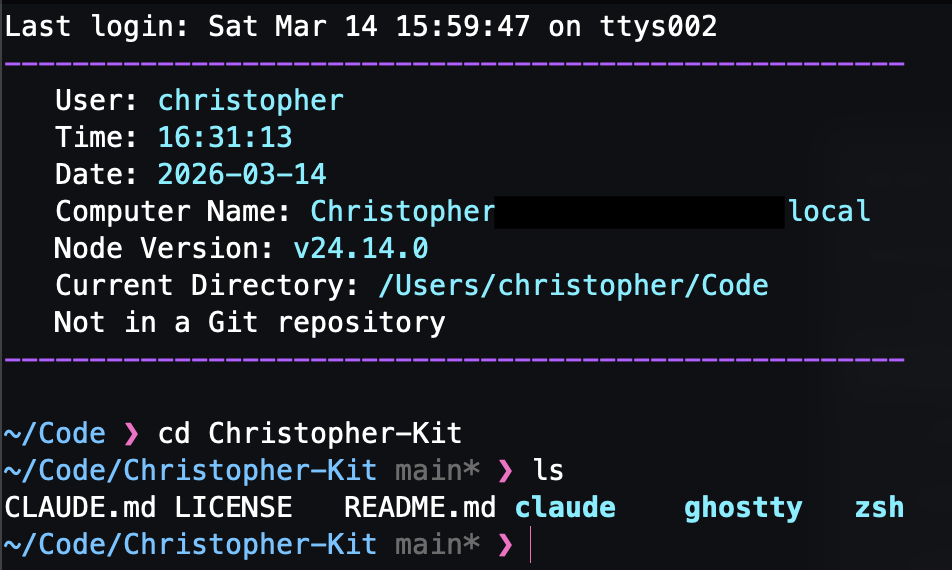

# Christopher-Kit

A portable dev toolkit with Claude Code agents, shell configs, and terminal setup.

[](claude/agents/)
[](zsh/)
[](ghostty/)
[](LICENSE)

Every time you set up a new machine, you spend hours recreating your dev environment - shell config, terminal theme, editor preferences, AI tooling. This repo is the fix. Clone it, symlink what you need, and get back to building.

## What's Included

- **[Zsh](zsh/)** - Custom `.zshrc` with Powerlevel10k, utility functions, and shell helpers
- **[Ghostty](ghostty/)** - Terminal config with Cyberdream color palette and semi-transparent background
- **[Claude Code](claude/)**
  - **[Status Line](claude/statusline/)** - Four-line status bar showing session time, git status, active model, context usage, and 5h rate limits
  - **[Hooks](claude/hooks/)** - Subagent tracking hook that powers the status line's agent display
  - **[Skills](claude/skills/)** - Custom slash commands (`/msg`, `/review-me`, `/grind`, `/audit`, `/scaffold`, `/deps`, `/handoff`)
  - **[Agents](claude/agents/)** - 39 specialized AI agents (React, Next.js, TypeScript, Python, Prisma, AWS, and more)
  - **[Settings](claude/settings/)** - Example settings.json (status line + hooks) and install commands for MCP servers (Context7, MUI, Tailwind, GitHub, AWS)

### How It Works Together

This isn't just a collection of configs - it's an integrated workflow where agents and skills work as a team.

The **[tech-lead-orchestrator](claude/agents/orchestrators/tech-lead-orchestrator.md)** is the brain. Give it a complex task and it analyzes your codebase, breaks the work into subtasks, and delegates each one to the right specialist - React expert for components, TypeScript expert for types, Prisma expert for database queries. It coordinates the entire build, then runs code review when everything's done.

The skills are your entry points into this system:

- `/scaffold` - Plan and build a new feature end-to-end through the orchestrator
- `/grind` - Verify your approach with the tech lead, then implement improvements
- `/review-me` - Code review with security, DRY, and performance checks
- `/audit` - Full codebase health check (architecture + quality)
- `/deps` - Check for outdated or vulnerable packages
- `/handoff` - Save full session context to a file before compacting or handing off to a fresh session

The **project-analyst** auto-detects your tech stack and the **team-configurator** wires up the right agents for your project.

## Quick Start

```bash
git clone https://github.com/christopherrobin/Christopher-Kit.git
cd Christopher-Kit
```

Each directory has its own README with detailed setup instructions. Pick what you need:

### Shell Config

> These overwrite `~/.zshrc` and `~/.p10k.zsh` - back up your existing files first.

```bash
cp zsh/.zshrc ~/.zshrc
cp zsh/.p10k.zsh ~/.p10k.zsh
```

### Ghostty Terminal
```bash
mkdir -p ~/.config/ghostty
cp ghostty/config ~/.config/ghostty/config
```

### Claude Code

> If `~/.claude/agents` already exists as a real directory, move it aside first (`mv ~/.claude/agents ~/.claude/agents.bak`) - otherwise the symlink nests inside it instead of replacing it. If you already have a `~/.claude/settings.json`, merge the example into it by hand instead of copying over it.

```bash
# Agents
ln -sfn "$(pwd)/claude/agents" ~/.claude/agents

# Skills
mkdir -p ~/.claude/skills
cp -r claude/skills/* ~/.claude/skills/

# Status line
cp claude/statusline/statusline-command.sh ~/.claude/statusline-command.sh

# Hooks (powers the status line's agent display)
mkdir -p ~/.claude/hooks
cp claude/hooks/track-subagents.sh ~/.claude/hooks/track-subagents.sh

# Settings (fresh machines only - see warning above)
cp claude/settings/settings.example.json ~/.claude/settings.json
```

MCP servers (Context7, GitHub, etc.) are installed with `claude mcp add` - see [claude/settings/](claude/settings/) for the commands.

### Preview

<table>
<tr>
<td align="center"><br><em>Shell startup with Powerlevel10k</em></td>
<td align="center"><br><em>Claude Code status line</em></td>
</tr>
</table>

## Customization

These configs reflect one person's preferences. Fork the repo and adapt anything to suit your own workflow - swap keybindings, change themes, adjust paths.

The agents and skills included here are a solid starting point, but the best ones you'll ever use are the ones you write yourself. Use the `skill-expert` and `agent-expert` agents to create your own, tailored to how you actually work.

## Contributing

PRs welcome. If you've built a useful skill, agent, or config that fits the toolkit, open a pull request. Keep it generic - no project-specific content.

## License

[MIT](LICENSE)
