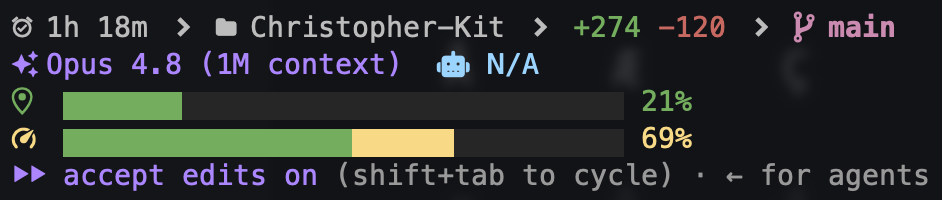

# Claude Code Status Line

A four-line status bar for the Claude Code CLI that shows session info, git status, context usage, rate limits, and the active model at a glance.



> **Note:** the preview image predates the current 4-line layout — it's illustrative, not exact.

## Font Requirement (read this first)

This status line is built around **Nerd Font** glyphs (brain, location pin, globe, chevrons, bolt, folder, git branch, etc.). **Without a Nerd Font set as your terminal font, the icons render as empty boxes or blanks.**

**Recommended / tested font: `MesloLGS NF`** — the Powerlevel10k build by romkatv:

- Install: https://github.com/romkatv/powerlevel10k#fonts (the four `MesloLGS NF` `.ttf` files)
- Then set it as your **terminal's** font. Example for Ghostty (`~/.config/ghostty/config`):
  ```
  font-family = MesloLGS NF
  ```
  (iTerm2 / Terminal / VS Code / etc. have an equivalent font setting.)

### Important caveat about glyph coverage

`MesloLGS NF` is a **lean, BMP-only build** — it covers most of the icons here, but a few glyphs (notably the **5h bolt**, a Material Design icon in the Unicode supplementary plane at `U+F04C5`) are **not** in it and only render via your OS's font fallback. On macOS this usually "just works," but it's not guaranteed everywhere.

**For complete, guaranteed coverage of every glyph**, install the **full Meslo Nerd Font (v3.0+)** instead, which includes the entire Nerd Fonts range (Material Design icons included):

- Download `Meslo.zip` from https://github.com/ryanoasis/nerd-fonts/releases/latest
- Install the `.ttf` files, then point your terminal at the family name it installs (e.g. `MesloLGS Nerd Font` — note this differs from `MesloLGS NF`).

If an icon shows as a blank/box, your font is the cause — verify the glyph exists in your installed font rather than the online cheat sheet (the cheat sheet renders with its own complete webfont and can show glyphs your font lacks).

## Other Prerequisites

- `jq` for JSON parsing
- `python3` (only used by the optional helper scripts, not the status line itself)
- macOS Keychain access (for the rate-limit feature — uses Claude Code's OAuth token at runtime)

## Setup

1. Copy the script to Claude's config directory:

```bash
cp statusline-command.sh ~/.claude/statusline-command.sh
```

2. Add to `~/.claude/settings.json`:

```json
{
  "statusLine": {
    "type": "command",
    "command": "bash ~/.claude/statusline-command.sh"
  }
}
```

## What It Shows

### Line 1 — session & git
| Element | Description |
|---------|-------------|
| Session duration | Time since the conversation started, with chevron separators |
| Project name | Current directory name |
| Lines diff | Lines added/removed in the session (`+N -N`) |
| Git branch | Branch name with dirty indicator (`*`) |
| Worktree | Shown when a git worktree is active |

### Line 2 — model & agents
| Element | Description |
|---------|-------------|
| Model | Sparkle icon (purple) + the active model's display name (shown first) |
| Agent status | Robot icon + active subagent name(s), or `N/A` when idle |

### Line 3 — local context
| Element | Description |
|---------|-------------|
| Location-pin icon + bar | Context-window usage. 33-wide gradient bar (green → amber → red); icon and `%` match the bar's tip color. Blinks at 87%+ |

### Line 4 — global limit
| Element | Description |
|---------|-------------|
| Bolt icon + bar | 5-hour Anthropic rate-limit usage (cached 60s). Same gradient bar style |

## Notes

- The rate-limit feature fetches usage data from the Anthropic API using your Claude Code OAuth token stored in macOS Keychain. No credentials are hardcoded — they're read at runtime. This feature only works on macOS with an active Claude Code session.
- Usage data is cached in `/tmp/.claude_usage_cache` and refreshed every 60 seconds to avoid excessive API calls.
- The progress bars use the `▆` (lower-three-quarters) block so the two stacked bars have a small vertical gap and don't visually merge.
